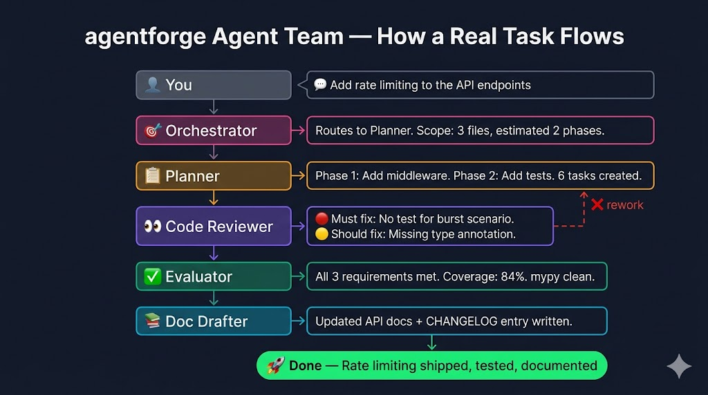
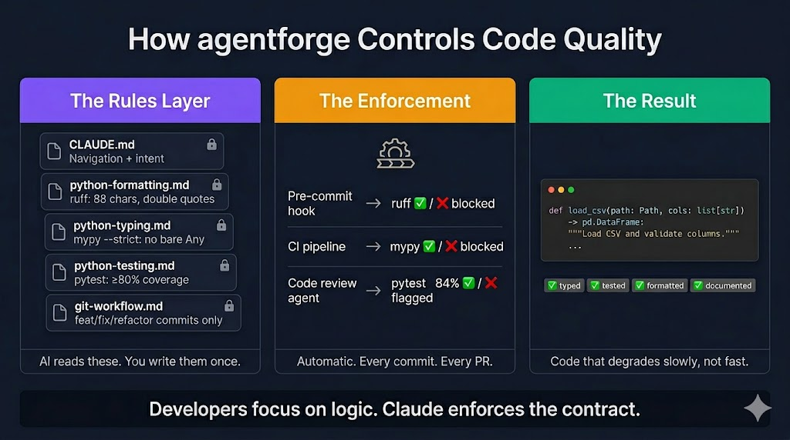
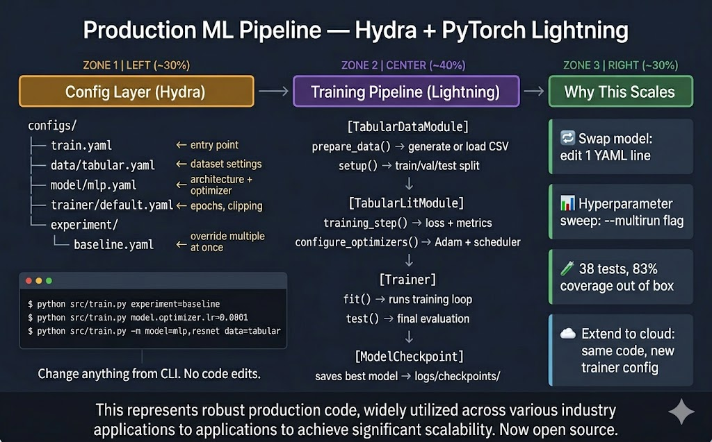

<div align="center">
  

  [](LICENSE)
  [](https://python.org)
  [](https://claude.ai/code)
  [](https://github.com/VincentMao/agentforge/actions)
  [](CONTRIBUTING.md)
</div>

---

<div align="center">
  
</div>

<br>

> **Skills, agents, rules, and prompt patterns that make AI-assisted development actually work at scale.**

Without structure, Claude on a large codebase produces code that works once, degrades fast, and has no tests.
agentforge fixes this with 9 behavioral skills, a 7-agent team, and 5 quality rules — installable in one command.

```bash
claude plugin install github:VincentMao/agentforge
```

→ **[5-minute walkthrough](QUICKSTART.md)** · [Refactor demo](examples/legacy-refactor/) · [ML pipeline](examples/data-pipeline/)

---

## What's Inside

| | Count | What |
|---|---|---|
| 🧠 **Skills** | 9 | Behavioral contracts: `10x-engineer`, `refactoring`, `unit-testing`, `debugging`, and more |
| 🤖 **Agents** | 7 | Team roles: `orchestrator`, `architect`, `planner`, `code-reviewer`, `evaluator`, `doc-drafter` |
| 📐 **Rules** | 5 | Python quality: ruff, mypy strict, pytest 80%+ coverage, git workflow |
| 🔀 **Prompt templates** | 7 | Orchestrator-worker, ReAct, evaluator-optimizer, reflection, and more |
| 💡 **Examples** | 2 | Legacy refactor (before/after Python) · ML pipeline (PyTorch + Hydra) |
| 📖 **Reference docs** | 4 chapters | Prompt engineering · LLM engineering · Multi-agent design · Research engineering |

---

## The Skill Interface

Type `/` in Claude Code after installing the plugin — your specialist team appears instantly.

<div align="center">
  
</div>

**All 9 skills:** `10x-engineer` · `planner` · `code-reviewer` · `refactoring` · `unit-testing` · `10x-data-scientist` · `architecture-review` · `debugging` · `documentation`

Each skill loads a behavioral contract — it changes *how Claude thinks*, not just what it outputs.

---

## The Agent Team

Seven specialized agents that coordinate on complex tasks. Here's a real task flowing through the full team:

<div align="center">
  
</div>

| Agent | Role | Hands off to |
|---|---|---|
| `orchestrator` | Routes the task, never writes code | planner |
| `planner` | Breaks work into phases with TodoWrite | implementation |
| `code-reviewer` | Runs pytest + mypy + ruff, reports by severity | evaluator or back to planner |
| `evaluator` | Checks output against original requirements | doc-drafter |
| `doc-drafter` | Writes docstrings, README updates, changelog | done |

---

## How Rules Govern Your Codebase

The `.claude/rules/` files are read by Claude at the start of every session. You write them once — Claude enforces them on every commit, every PR, every code review.

<div align="center">
  
</div>

```bash
# What happens automatically on every git commit:
ruff check src/ tests/ --fix   # formatting + linting
mypy src/ --strict             # type checking
pytest tests/ --cov=src --cov-fail-under=80   # tests + coverage gate
```

---

## The Quality Gate

Every commit passes through four automated gates, enforced by pre-commit hooks:


---

## The Refactor Demo

Open the messy `before/` code in Claude Code, type `/refactoring`. The skill enforces tests-first, one seam at a time — no big-bang rewrites.

<video src="assets/refactor-before-after_video.mp4" controls loop muted width="100%"></video>

| | `before/` | `after/` |
|---|---|---|
| Functions | 1 god function, 300+ lines | 4 pure functions, each < 40 lines |
| Global state | `data = None`, `model = None` | None — pure functions only |
| Type annotations | Zero | 100%, `mypy --strict` clean |
| Tests | Zero | 18 tests, 100% coverage |
| Imports | Circular, unstructured | Explicit, typed |

```bash
cd examples/legacy-refactor/before
claude   # then type: /refactoring
```

---

## The ML Pipeline

A production-ready PyTorch + Hydra training pipeline — the same pattern used in large-scale ML systems. Swap a model, change a dataset, or run a hyperparameter sweep from the CLI with no code edits.

<div align="center">
  
</div>

```bash
cd examples/data-pipeline
pip install -e ".[dev]"
make train                                        # synthetic data auto-generated

python src/train.py experiment=baseline           # named experiment override
python src/train.py model.optimizer.lr=0.0001     # single hyperparameter
python src/train.py "model.optimizer.lr=0.001,0.0001" --multirun   # sweep
```

---

## Prompt Templates

Seven orchestration patterns — each with a concrete worked example and an explanation of when (and when not) to use it. Full templates with anti-patterns are in [`prompt-templates/`](prompt-templates/).

---

### Orchestrator-Worker — Fan Out, Then Merge

Use when a task can be broken into N **independent** parallel subtasks that don't need each other's output.

<div align="center">
  
</div>

→ [`prompt-templates/orchestrator-worker.md`](prompt-templates/orchestrator-worker.md)

---

### Evaluator-Optimizer — Iterate Until Quality Threshold

Use when you need output to meet a measurable bar — generate → score → improve → repeat until ≥ threshold.

<div align="center">
  
</div>

→ [`prompt-templates/evaluator-optimizer.md`](prompt-templates/evaluator-optimizer.md)

---

### Parallel Agents — Same Task, N Independent Contexts

Use when you have the same task type to run across multiple independent files or contexts simultaneously. 3× faster than sequential.

<div align="center">
  
</div>

→ [`prompt-templates/parallel-agents.md`](prompt-templates/parallel-agents.md)

---

### Reflection — Adversarial Self-Critique Before Delivering

Use for high-stakes outputs: architecture decisions, security analysis, code reviews. One reflection loop catches what a first pass misses.

<div align="center">
  
</div>

→ [`prompt-templates/reflection.md`](prompt-templates/reflection.md)

---

### Plan and Execute — Approval Gate Before Touching Code

Use before any task touching more than 2 files, or where wrong assumptions mean wasted hours. Plan is reviewed and approved before a single line changes.

<div align="center">
  
</div>

→ [`prompt-templates/plan-and-execute.md`](prompt-templates/plan-and-execute.md)

---

### ReAct — Reasoning + Acting for Exploratory Tasks

Use when the next action depends on what the previous one returned. The structured Thought → Action → Observation loop prevents guessing.

<div align="center">
  
</div>

→ [`prompt-templates/react-pattern.md`](prompt-templates/react-pattern.md)

---

### Chain of Thought — Show Reasoning Before the Answer

Use for algorithm design, multi-constraint optimization, or any problem where intermediate steps change the answer. Forces explicit reasoning before conclusions.

<div align="center">
  
</div>

→ [`prompt-templates/chain-of-thought.md`](prompt-templates/chain-of-thought.md)

---

## Quick Start

<div align="center">
  
</div>

```bash
# Install as Claude Code plugin — all 9 skills activated immediately
claude plugin install github:VincentMao/agentforge

# Or drop .claude/ directly into any existing Python project
cp -r /path/to/agentforge/.claude /your/project/
```

→ Full walkthrough: **[QUICKSTART.md](QUICKSTART.md)**

---

## Contributing

Contributions welcome — skills, agents, prompt templates, reference chapter sections, and bug fixes.

- 📖 Read **[CONTRIBUTING.md](CONTRIBUTING.md)** for how to add a skill or agent
- 💬 Open a **[GitHub Discussion](https://github.com/VincentMao/agentforge/discussions)** for questions, ideas, or showing what you built
- 🐛 File an **[Issue](https://github.com/VincentMao/agentforge/issues)** for bugs

---

## Contact

Built by [Vincent Xianglun Mao](https://github.com/VincentMao) — research scientist, large-scale ML systems.

For collaborations, research, or questions:  
📧 **maoxianglun@gmail.com**  
🔗 **[LinkedIn](https://www.linkedin.com/in/xianglun-mao-phd-7608a291/)**  
💬 **[GitHub Discussions](https://github.com/VincentMao/agentforge/discussions)**

---

## License

MIT — see [LICENSE](LICENSE).
