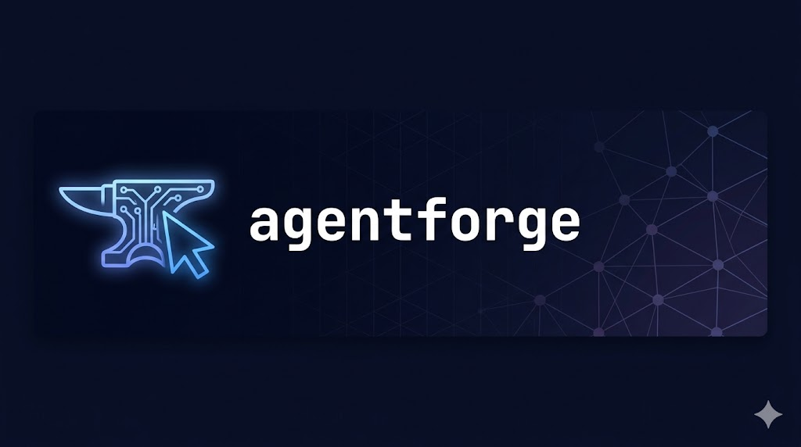
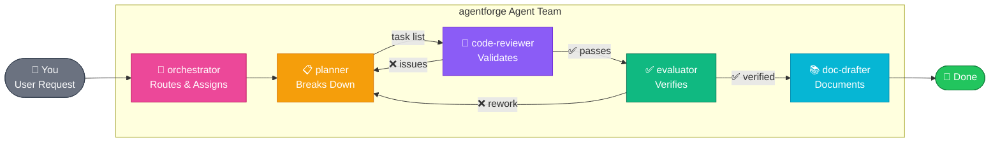
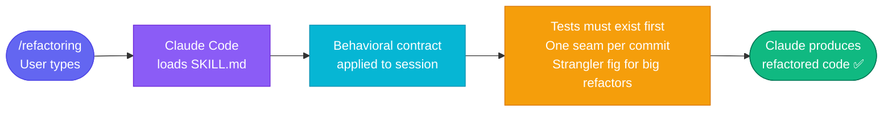
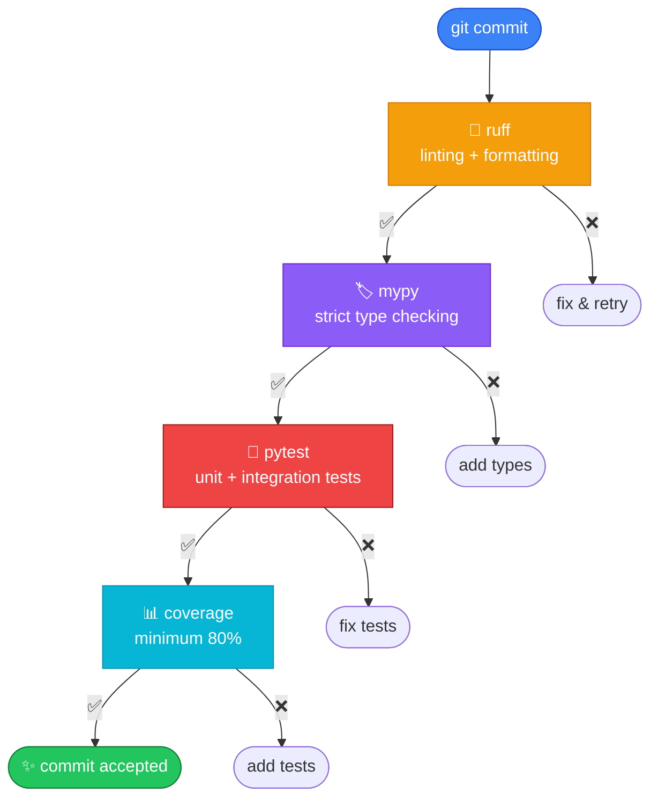

<div align="center">
  

  [](LICENSE)
  [](https://python.org)
  [](https://claude.ai/code)
  [](https://github.com/VincentMao/agentforge/actions)
  [](CONTRIBUTING.md)
</div>

---

> **Skills, agents, rules, and prompt patterns that make AI-assisted development actually work at scale.**

Without structure, Claude on a large codebase produces code that works once, degrades fast, and has no tests.  
agentforge fixes this with 9 behavioral skills, a 7-agent team, and 5 quality rules — installable in one command.

```bash
claude plugin install github:VincentMao/agentforge
```

→ **[5-minute walkthrough](QUICKSTART.md)** · [Refactor demo](examples/legacy-refactor/) · [ML pipeline](examples/data-pipeline/)

---

## What's Inside

| | Count | What |
|---|---|---|
| 🧠 **Skills** | 9 | Behavioral contracts: `10x-engineer`, `refactoring`, `unit-testing`, `debugging`, and more |
| 🤖 **Agents** | 7 | Team roles: `orchestrator`, `architect`, `planner`, `code-reviewer`, `evaluator`, `doc-drafter` |
| 📐 **Rules** | 5 | Python quality: ruff, mypy strict, pytest 80%+ coverage, git workflow |
| 🔀 **Prompt templates** | 7 | Orchestrator-worker, ReAct, evaluator-optimizer, reflection, and more |
| 💡 **Examples** | 2 | Legacy refactor (before/after Python) · ML pipeline (PyTorch + Hydra) |
| 📖 **Reference docs** | 4 chapters | Prompt engineering · LLM engineering · Multi-agent design · Research engineering |

---

## The Agent Team



---

## How Skills Work

Type `/refactoring` in Claude Code → the behavioral contract loads → Claude changes how it thinks and acts.



**All 9 skills:** `10x-engineer` · `planner` · `code-reviewer` · `refactoring` · `unit-testing` · `10x-data-scientist` · `architecture-review` · `debugging` · `documentation`

---

## The Quality Gate

Every commit passes through four automated gates — enforced by pre-commit hooks:



---

## The Refactor Demo

Open the messy `before/` code in Claude Code, type `/refactoring`. Watch it:

| | `before/` | `after/` |
|---|---|---|
| Functions | 1 god function, 300+ lines | 4 pure functions, each < 40 lines |
| Global state | `data = None`, `model = None` | None — pure functions only |
| Type annotations | Zero | 100%, `mypy --strict` clean |
| Tests | Zero | 18 tests, 100% coverage |
| Imports | Circular, unstructured | Explicit, typed |

```bash
cd examples/legacy-refactor/before
claude   # then type: /refactoring
```

---

## The ML Pipeline

A production-ready PyTorch + Hydra training pipeline. Mirrors the vizard_project pattern.

```bash
cd examples/data-pipeline
pip install -e ".[dev]"
make train   # synthetic data auto-generated
```

Override any hyperparameter from the CLI:
```bash
python src/train.py experiment=baseline
python src/train.py model.optimizer.lr=0.0001 trainer.max_epochs=50
python src/train.py "model.optimizer.lr=0.001,0.0001" --multirun
```

---

## Prompt Templates

7 orchestration patterns — each with worked examples and anti-patterns:

| Pattern | When to use |
|---|---|
| [`orchestrator-worker`](prompt-templates/orchestrator-worker.md) | Break task into N independent parallel subtasks |
| [`evaluator-optimizer`](prompt-templates/evaluator-optimizer.md) | Iterate against a rubric until quality threshold is met |
| [`parallel-agents`](prompt-templates/parallel-agents.md) | Same task type across N independent contexts |
| [`reflection`](prompt-templates/reflection.md) | Adversarial self-critique before delivering high-stakes output |
| [`plan-and-execute`](prompt-templates/plan-and-execute.md) | Approval gate before touching code |
| [`react-pattern`](prompt-templates/react-pattern.md) | Exploratory tasks where next action depends on previous result |
| [`chain-of-thought`](prompt-templates/chain-of-thought.md) | Complex reasoning with intermediate steps |

---

## Quick Start

```bash
# Install as Claude Code plugin (one command, all 9 skills activated)
claude plugin install github:VincentMao/agentforge

# Or copy .claude/ into any existing project
cp -r /path/to/agentforge/.claude /your/project/
```

→ Full walkthrough: **[QUICKSTART.md](QUICKSTART.md)**

---

## Contributing

Contributions welcome — skills, agents, prompt templates, reference chapter sections, and bug fixes.

- 📖 Read **[CONTRIBUTING.md](CONTRIBUTING.md)** for how to add a skill or agent
- 💬 Open a **[GitHub Discussion](https://github.com/VincentMao/agentforge/discussions)** for questions, ideas, or showing what you built
- 🐛 File an **[Issue](https://github.com/VincentMao/agentforge/issues)** for bugs

---

## Contact

Built by [Vincent Xianglun Mao](https://github.com/VincentMao) — research scientist, large-scale ML systems.

For collaborations, research, or questions:  
📧 **maoxianglun@gmail.com**  
🔗 **[LinkedIn](https://www.linkedin.com/in/xianglun-mao-phd-7608a291/)**  
💬 **[GitHub Discussions](https://github.com/VincentMao/agentforge/discussions)**

---

## License

MIT — see [LICENSE](LICENSE).
